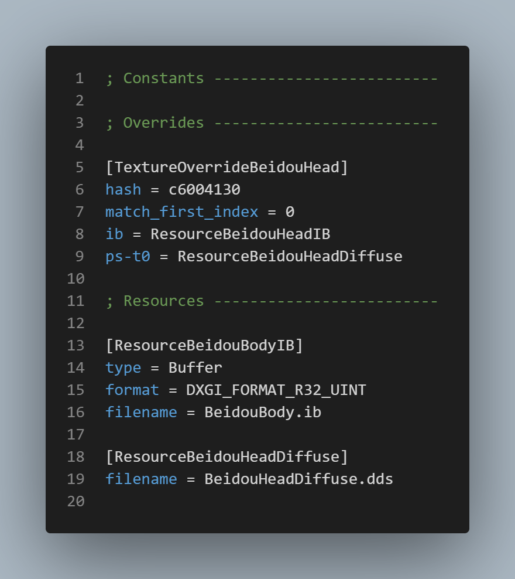

<!--
V0.2.0
By lewis252310

-->
#### Preface
This is a GIMI-based ini file documentation.
This is the first version, so only the most basic syntax is covered.
Some programming language knowdelege may be required.
But don't worry, we will update it in the future, the ultimate goal is to make `ini` easy to understand.
Originally written in Chinese, then revised by a non-english native, so if you are not reading the Chinese version, you may need pay attention to the discrepancies caused by translation.

---

### Notice! This documentation is limited to GIMI and does not apply to other versions of 3dmigoto.

---

### .ini Structure brief
Since `ini` is not the focus of this article, and the relevant `ini` syntax can be found on the Internet, we will only explain how to read `ini` in short.
The following is an example, which is from a very common mod syntax.

It can be simply divided into three parts: sections, parameters, and comments.
Sections and parameters are case-insensitive, but in GIMI, sections are written in uppercase camel case.

__**Section**__
The part enclosed in [] is the beginning of a **section**. A section represents a code block, and its scope includes the current line up to the line before the next section or the end of the file.

__**Properties**__
Properties are sub-items of a section. I haven't encountered standalone properties so far. An easy way to identify them is that they always have an `=` sign.

__**Comments**__
Also referred to as annotations, comments start with `;` and continue until the end of the line. Here's one thing to note: in INI files, comments can only occupy a separate line. In other words, placing a semicolon after a property or section is not allowed.
```ini
; Commenting a whole line separately is allowed
[TextureOverrideA] ; Commenting after a section or property is not allowed
hash = abcd1234 ; Note that commenting in the wrong place will result in incorrect syntax highlighting
```

That's the basic introduction to INI files. As long as you know how to distinguish sections and properties, and how to write comments, you should be good. If you're interested, you can check [Wiki](https://en.wikipedia.org/wiki/INI_file) for more information.
Lastly, it's worth mentioning that INI files are case-insensitive, but in GIMI, section names follow the PascalCase convention.

---

Now we can start to talk about the modifiers and reserved words used in GIMI's `ini` files.

### Syntax tree
> Here is the syntax tree, modifiers are in the next section

[[\*Override\*]](#override)

├ [hash](#hash)

├ [handling](#handling)

├ [drawindexed](#drawindexed)

├ [match_first_index](#match_first_index)

├ [vb0, vb1, vb2, ...](#vbx)

├ [ib](#ib)

├ [ps-t0, ps-t1, ps-t2, ps-t3, ...](#ps-tx)

├ [filter_index](#filter_index)

├ [allow_duplicate_hash](#allow_duplicate_hash)

└ [match_priority](#match_priority)

[[Resource*]](#resource)

├ [type](#type-resourse)

├ [filename](#filename)

├ [format](#format)

├ [stride](#stride)

└ [data](#data)

[[CommandList*]](#commandlist)

[[Constants]](#constants)

[[Present]](#present)

[[Key*]](#key-section)

├ [key](#key-properties)

├ [type](#type-key)

└ [warp](#warp)

> If you can't find what you need here, it might be a reserved word or a modifier.

---

### Modifiers
> Modifiers here, the syntax tree is in the previous section.

[post](#post)

[pre](#pre)

[global](#global)

[local](#local)

[persist](#persist)

[ref | reference](#ref)

[copy](#copy)

---

### Reserved words
> Reserved words.

[time](#time)

[if, endif, else if, else](#condition)

[run](#run)

---

### Rules
> Here are some general rules.

[Variable](#variable)

[Condition](#condition)

[ERROR msg](#error-msg)

[Operators](#operators)

---

## Override

There are two types of overrides: `TextureOverride` and `ShaderOverride`. When there is a corresponding hashed object on the screen, it triggers the operation of the respective override section. This is the core functionality of GIMI and the starting point for all mods.

```ini
[*Override*]
[TextureOverrideLumineBody]
[ShaderOverridGroundHealthBar]
```
#### hash

It tells GIMI which object to pay attention to and triggers the corresponding action when found.
```ini
[TextureOverrideLumineBody]
hash = afd36b46
```

#### handling

It specifies the rendering operation for the designated object, usually using `skip` to bypass rendering.
```ini
[TextureOverrideLuminePantsu]
handling = skip
```

#### drawindexed

Tell GIMI to perform our own rendering instead of using the game's rendering. It is usually used in conjunction with [handling](#handling).
```ini
[TextureOverrideLumineBody]
drawindexed = auto
```

#### draw

Assigns x vertex in memory space to be drawn at y index. DirectX Documentation: https://learn.microsoft.com/en-us/windows/win32/api/d3d11/nf-d3d11-id3d11devicecontext-draw
```ini
[TextureOverrideLumineBlend]
draw = x, y
```

#### match_first_index

Specifies the starting position of the buffer. Sometimes, a hash may contain more than one material, so it is necessary to specify the correct resource to load.
```ini
[TextureOverrideLumineBody]
match_first_index = 25600
```

#### vbx
Vertex buffer. It usually points directly to another [Resource](#resource) section.
```ini
[TextureOverrideLumineBody]
vb0 = ResourceLuminePosition
```

#### ib
Index buffer. It usually points directly to a [Resource](#resource) section that contains the IB. There can only be one index buffer per object.
```ini
[TextureOverrideLumineBody]
ib = ResourceLumineBodyIB
```

#### ps-tx
Texture resource layer. There are several different types, generally, t0 represents the texture map, t1 represents the light map, t2 represents the metal map, and t3 represents the shadow map. In 3.0 characters this convetion is broken. For more info and fix check: 
```ini
[TextureOverrideLuminePantsu]
ps-t0 = ResourceLuminePantsuDiffuse
ps-t1 = ResourceLuminePantsuLightMap
ps-t2 = ResourceLuminePantsuMetalMap
ps-t3 = ResourceLuminePantsuShadowRamp
...

```

#### filter_index

Declares a check value that allows checking elsewhere. It is likely to occupy ps-t0, so it is uncertain whether it is a good approach.
<!-- Actually it's still not very clear (for me), from someone, it seems that it can disable a specified filter. -->
```ini
[TextureOverrideLumineGlasses]
filter_index = 34
```

#### allow_duplicate_hash
At ShaderOverride.
Controls whether to allow overriding the same hash or not.

Possible values are:
 - true: Overrides when duplicates exist.
 - false: Does not override when duplicates exist.
 - overrule: Forces the override, which seems to be a plugin-level override.

```ini
[ShaderOverrideLumineQEffect]
hash = 030dbce199e10697
allow_duplicate_hash = overrule
```

#### match_priority
At TextureOverride.
Declares the order priority for overrides. The higher the value, the higher the priority.
It is not commonly used in GIMI, except in cases where it is used to eliminate hash conflicts. In those cases, setting it to 0 is sufficient.
```ini
[TextureOverrideLumineGlasses]
match_priority = 0
```

---

## Resource

Not sure if it is one of the reserved words in GIMI, but since sections with resources are usually prefixed with `Resource` let's consider it a reserved word. This makes it easier to identify and avoids confusion with other sections that have specific purposes. These sections are typically used to store various resource locations.
```ini
[Resource*]
[ResourceLuminePantsu]
[ResourceMyRGBWeapon]
```

#### type (Resourse)

This is a properties under [Resource](#resource), not under [Key](#key-section).
It declares the type of the resource, which is generally used for buffer types.
```ini
[ResourceLuminePantsuPosition]
type = Buffer
``` 

#### filename

Only appears under [Resource](#resource). It uses a relative path to point to the storage location of the resource. It is unclear whether absolute paths are supported, but using absolute paths in this context of redistributable data wouldn't make much sense.
```ini
[ResourceLumineBodyDiffuse]
filename = .\LumineParts\LumineBodyDiffuse.dds
```

#### format

Used for IB (Index Buffer) resources, specifies the size of a single index value.
```ini
[ResourceLumineBodyIB]
format = DXGI_FORMAT_R32_UINT
```

#### stride
Used for VB (Vertex Buffer) resources, specifies the byte size of a single vertex's total data.
```ini
[ResourceLuminePantsu]
stride = 20
```

#### data
Used for ?? resources, it is a string.
```ini
[ResourceLuminePantsu]
data = "Jsut a string."
```

---

## CommandList

Not certain if `CommandList` is one of the reserved words, but theoretically, it is just a section where multiple properties are grouped together, and it is only called when needed. However, its functionality is similar to a function, so I believe it is better to consider it a reserved word.
```ini
[CommandList*]
[CommandListToggleLogic]
[CommandListCallTheAmbulance]
```
Since the `CommandList` section is all about advanced operations, there are no fixed properties. The only elements that might be repeated are various [Variables](#variable) and [Conditions](#condition).

---

## Constants

The initialization location for global variables is under the `Constants` section. All global variables need to be declared there for GIMI to recognize them. The initialization only occurs once when the `ini` file is read. For more information about variables, please refer to the [Variables section](#variable).
```ini
[Constants]
global $active = 0
```

---

## Present

This section is executed at the beginning of each frame and is intended for code that needs to be continuously executed. It is commonly used for real-time calculations, such as switching appearances based on key inputs or various interactive effects.
```ini
[Present]
post $active = 0
```
Similar to [CommandList](#commandlist), is an area for various operations. so it does not have fixed properties. However, it is generally not directly linked to [Resource](#resource) sections. Instead, it is typically linked to a CommandList, which then calls the Resource.


---

## Key (section)

Defines which keypress conditions GIMI should detect.
After pressing it, the set operation will be performed.
The following example defines a Q key and [type](#type-key) is `toggle`
```ini
[KeyHelp]
key = q
type = toggle
```

#### key (properties)
At [Key](#key-section) section, section to specify which key to listen for.
All available key types can be found [here](https://learn.microsoft.com/zh-tw/windows/win32/inputdev/virtual-key-codes?redirectedfrom=MSDN).
```
[KeyHelp]
key = q
```

#### type (Key)

This is a properties under [Key](#key-section), not under [Resourse](#resource).
It declares the type of the key. There are four available values: default, cycle, hold, and toggle.
1. default: Executes the pre-configured operation. This is the default type when no "type" is specified, and it simply runs the configured settings.
2. cycle: Cycles through the written list in order. Whether the cycle is allowed to wrap around (connect the first and last elements) is controlled by [warp](#warp).
3. hold: Triggered continuously when the key is held down. This can be used for skills or actions that require holding down a key.
4. toggle: Toggles between two states. If the previous trigger was 1, the next trigger will be 0.

You can find more information about keys in `d3dx.ini` of GIMI.

```ini
[KeyK]
key = k
type = cycle
$swapvar = 0, 1, 2, 3
```

#### warp
Controls whether the key-cycle type allows wrapping around (connecting the first and last elements).
The default value is True.
```ini
[KeyK]
key = k
warp = false
type = cycle
$swapvar = 0, 1, 2, 3
```

---

## Modifiers

#### post

Specifies that the corresponding parameter is computed at the ***beginning of a frame***, such as setting the start time of a frame.
```ini
post $triggerDate = time
```

#### pre

Specifies that the corresponding parameter is computed at the ***end of a frame***, such as calculating the number of times [Present](#present) has been executed.
```ini
pre $auxTime = $auxTime + 1
```

#### global

The necessary modifier when declaring a **global** variable. [Variable rules can be found here](#variable).
Also, note that global variables are only declared within the [Constants](#constants) section.

```ini
[Constants]
global $a_global_var = 1
```

#### local

The necessary modifier when declaring a **local** variable. [Variable rules can be found here](#variable).
Local variables can be declared anywhere needed for calculations. However, it is uncertain how GIMI handles the recycling mechanism for local variables. At least for now, local variables are not seen frequently.

```ini
[AnySection]
local $i = 0
```

#### persist

The necessary modifier when declaring a **persistent** variable. [Variable rules can be found here](#variable).
This modifier is only used for global variables. Once declared, the variable will persist and be stored in `d3dx_user.ini`. It will only be reset when you use `Ctrl + Alt + F10`.
```ini
[Constants]
global persist $a_persist_var = 1
```

#### ref

ref or reference are used as pointers to a resource. It's up to the programmer to take advantage of this powerful tool
```ini
pre ResourceHelp = ref ResourceHelpFull
pre ResourceHelp = reference ResourceHelpFull
```
#### copy

It copies the resource into the new one. Very helpful to keep a copy of a resource before it gets modified by another shader or draw call.
```ini
pre ResourceHelp = copy ResourceHelpFull
```

#### run

Declares the section to be executed.
Commonly used to refer to a [CommandList](#commandlist) for further computations.
```ini
[KeyChangeColor]
run = CommandListLumineChangePanTsuColor
```

---

#### Variable

In GIMI, variables are identified by starting with the `$` symbol.
And if there is no `$` symbol in some positions that should be variables, that is a [reserved word](#reserved-words)
```ini
$last_date = time
; $last_date is our defined variable, while time is a reserved word in GIMI.
```
Note: the variable `time` saves a float with the time in seconds since the game launched.
#### Condition

GIMI has condition control reserved words, including `if`, `else if`, `else`, and `endif`.
The condition block starts with `if` and ends with `endif`. Nesting is supported.
If you are new to programming, it is recommended to familiarize yourself with condition control syntax in other programming languages. This explanation will not delve into it extensively.

```ini
if time == $lest_date + 10.0
    run = CommandListA
else if time == $lest_date + 15.0
    run = CommandListB
else
    run = CommandListC
endif
```

#### ERROR msg

Certain compilation errors, specially in shaders, will be shown in screen. When it comes to ini files it will just show warnings that hint possible mod conflicts. Good to troubleshoot broken mods.

#### Arimethical Operators

This is just a list of operators allowed in GIMI and does not include any usage tutorials.

| Operators | Name           | Note                            |
| --------- | -------------- | ------------------------------- |
| +         | Addition       |                                 |
| -         | Subtraction    |                                 |
| *         | Multiplication |                                 |
| /         | Division       |                                 |
| //        | Division Floor |                                 |
| %         | Modulus        |                                 |
| =         | Assignment     |                                 |
| ==        | Equal          |                                 |
| !=        | Not equal      |                                 |
| !==       | Not equal      | Similar to `!=` but more strict |

#### Logical Operators

This is just a list of operators allowed in GIMI and does not include any usage tutorials.

| Operators | Name           | Note                      |
| --------- | -------------- | ------------------------- |
| &&        | AND            |                           |
| \|\|      | OR             |                           |
| ( )       | Parenthesis    |                           |
